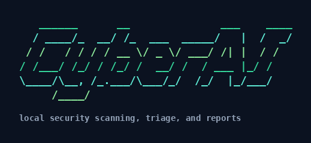

# CyberAI

<p align="center">
  
</p>

CyberAI is a local CLI security and code-analysis tool. It runs deterministic scanners over a project, normalizes the results, and can write SARIF, JSON, Markdown, HTML, JUnit, CSV, and terminal reports.

The scanner is read-only with respect to the target project. It does not modify source files, lockfiles, configs, or git state.

## Quick Start

```bash
# Build and install the cyberai binary
./setup.sh

# First-time project setup (tools + config)
cyberai setup

# Quick local scan (terminal output only; no LLM; no report files)
cyberai scan

# Save SARIF/JSON/HTML reports
cyberai scan --save

# CI pipeline scan
cyberai scan --preset ci -o reports/

# Check toolchain and config
cyberai doctor
```

Running `cyberai` with no subcommand shows the CyberAI ASCII logo, command list, and global flags.

## Install Or Update

Use the setup script from the repo root:

```bash
./setup.sh
```

By default this runs tests, builds the CLI, and installs it to the Go binary directory:

```text
$GOBIN/cyberai
# or, when GOBIN is empty:
$GOPATH/bin/cyberai
# usually:
$HOME/go/bin/cyberai
```

Install to a system path instead:

```bash
./setup.sh --system
```

That installs to `/usr/local/bin/cyberai`. If the directory needs elevated permission, the script uses `sudo install`.

Useful setup flags:

```bash
./setup.sh --skip-tests          # build/install without running tests
./setup.sh --install-tools       # also install managed scanners
./setup.sh --system --install-tools
./setup.sh --prefix "$HOME/.local/bin"
./setup.sh --help
```

After install, verify:

```bash
command -v cyberai
cyberai --version
cyberai tools list
```

## Managed Scanner Tools

CyberAI currently shells out to:

- **Semgrep** for multi-language SAST.
- **Gitleaks** for secret detection.
- **Trivy** for SCA, IaC, and license checks.
- **Checkov** for deeper IaC and policy checks.
- **Hadolint** for Dockerfile linting.
- **Zizmor** for GitHub Actions security checks.
- **Grype**, **OSV-Scanner**, and **govulncheck** for dependency CVE coverage.
- **Actionlint** for GitHub Actions correctness.
- **Syft** for SBOM generation via `cyberai sbom`.

All of the above except Semgrep (pipx/system) are installed by `cyberai tools install`. Scans skip missing scanners by default. Install the full toolchain when you want every category available:

```bash
cyberai tools list
cyberai tools install              # all managed scanners
cyberai tools install gitleaks trivy syft actionlint
cyberai tools update
cyberai tools remove gitleaks
```

Or install the binary and scanners in one step from the repo:

```bash
./setup.sh --install-tools
./setup.sh --prefix "$HOME/.local/bin" --install-tools
```

Managed binaries live in `~/.cyberai/bin`, and CyberAI prepends that directory to `PATH` at startup. Python-based managed tools use CyberAI-owned virtualenvs under `~/.cyberai/venvs`. Tool state lives in `~/.cyberai/state/tools.json`.

`cyberai tools install` is idempotent: rerunning it refreshes tool state and leaves existing managed binaries in place unless `--force` is used. Trivy initializes its vulnerability database automatically on the first scan when the local DB is missing.

## Scan Output

By default, `cyberai scan` prints a **terminal summary only**. It does not write report files unless you ask:

```bash
cyberai scan --save              # write default formats to ./cyberai-reports
cyberai scan -o /tmp/reports     # write to a custom directory
cyberai scan --format sarif -o . # write specific formats only
```

Use JSON when another program needs to consume the end-of-run CLI summary:

```bash
cyberai scan --summary json
```

Suppress the final summary block:

```bash
cyberai scan --summary off
```

Config-file output paths are confined under the scanned project root. A CLI-provided `--output` path is treated as explicit user intent and may point elsewhere.

### Scan presets

Presets bundle common flag combinations:

| Preset | Behavior |
|---|---|
| `quick` | Default: terminal output, LLM off |
| `full` | All report formats, EPSS/KEV enrichment, smart LLM routing |
| `ci` | SARIF + JUnit + JSON, enrichment, non-zero exit on findings |
| `pr` | Changed files only (`--diff origin/HEAD`), medium+ severity |

```bash
cyberai scan --preset full
cyberai scan --preset ci -o reports/
cyberai scan --preset pr
```

### Scanner categories (`--only`)

Internal names: `sast`, `secrets`, `sca`, `iac`, `license`, `docker`, `cicd`

Aliases also work: `code`, `dependencies`, `infrastructure`, `containers`, `pipelines`

```bash
cyberai scan --only secrets
cyberai scan --only sast,sca
cyberai scan --only dependencies
cyberai scan --only iac,docker,cicd
```

Missing scanners are skipped with a summary at the end of the scan. Install them with `cyberai setup`, `cyberai tools install`, or `cyberai scan --install-missing`.

## Commands

```bash
# Onboarding and health
cyberai setup [path]            # install tools, write .cyberai.yaml, optional --llm
cyberai doctor [path]           # check tools, config, git, LLM key
cyberai init [path]             # write starter .cyberai.yaml only
cyberai config show [path]      # print effective config (--format yaml|json)

# Scanning
cyberai scan [path]             # quick scan (terminal only)
cyberai scan --save             # write report files
cyberai scan --smart            # enable LLM router + HTML summary
cyberai scan --no-llm           # disable LLM explicitly
cyberai scan --preset ci -o out/
cyberai scan --diff main        # findings in changed files only
cyberai scan --enrich           # EPSS + CISA KEV priority labels
cyberai scan --install-missing  # install missing managed scanners before scan

# Suppressions
cyberai suppress F-abc123 --reason "false positive"
cyberai suppress add --rule-id RULE --reason "mitigated" --expires 90d
cyberai suppress list
cyberai suppress remove S-abc123

# Tools
cyberai tools list
cyberai tools install [tool...]
cyberai tools update [tool...]
cyberai tools remove [tool...]

# Reports and SBOM
cyberai report compare --baseline old/report.json --current new/report.json
cyberai sbom [path]             # requires syft (cyberai tools install syft)
cyberai sbom --format spdx
cyberai sbom --image myapp:latest
cyberai sbom --enrich           # attach Grype vulnerability data
```

Run `cyberai <command> --help` for full command-specific flags.

## Common Commands

Legacy quick reference (see **Commands** above for the full list):

```bash
cyberai setup && cyberai scan
cyberai scan --save
cyberai scan --preset ci -o reports/
cyberai doctor
cyberai tools list
cyberai init
cyberai report compare --baseline a.json --current b.json
```

## Report Formats

| Format | Use case |
|---|---|
| SARIF | CI integration, GitHub code scanning, GitLab, and similar systems |
| JSON | Full normalized machine-readable report |
| Markdown | PR or issue comments |
| HTML | Self-contained report with an optional executive summary |
| JUnit | CI test result dashboards |
| CSV | Spreadsheet and data workflows |
| terminal | Pretty stdout report (default); skipped in `--ci` |

## Optional LLM Router

LLM routing is **off by default**. Enable it per run with `--smart`, or during project setup with `cyberai setup --llm`.

If a Gemini API key is not detected, CyberAI prompts interactively when LLM is enabled. Once provided, CyberAI persists your API key and preferred model in `~/.cyberai/config.json`.

CyberAI uses Gemini for two tasks when enabled:
1. **Router**: chooses which scanners and rulesets to run based on the detected project profile.
2. **Summarizer**: writes the security executive summary for the HTML report.

```bash
cyberai scan --smart
cyberai scan --smart --pick-model
cyberai scan --no-llm              # disable explicitly
cyberai scan --preset ci           # CI disables LLM automatically
```

The scanners remain the source of findings. The LLM only routes and summarizes.

## Configuration

For a full first-time setup (tools + config), use:

```bash
cyberai setup
```

To write only a starter config file:

```bash
cyberai init
```

Inspect effective settings for a project:

```bash
cyberai config show
cyberai config show --format json
```

CyberAI reads `.cyberai.yaml` or `.cyberai.yml` from the project root. CLI flags override the config file.

Example:

```yaml
scanners:
  - sast
  - secrets
  - sca

severity_threshold: low

# Used when you run: cyberai scan --save
output:
  path: cyberai-reports
  formats:
    - sarif
    - json
    - markdown
    - html
    - terminal

# Enable smart routing: cyberai scan --smart
llm:
  enabled: false
  provider: gemini
  model: gemini-3.5-flash

ui:
  color: auto
  progress: auto
```

Suppress known false positives in `.cyberai-suppressions.yaml` (see `cyberai suppress --help`).

## Development

```bash
go test ./...
go build ./...
go run ./cmd/cyberai --help
```

End-to-end packaging smoke test (fresh `HOME`, `cyberai tools install`, benchmark scan):

```bash
./scripts/test-isolated-packaging.sh
./scripts/docker-packaging-test.sh   # same test inside Docker (recommended)
```

## Benchmarks

CyberAI includes an intentionally vulnerable Python benchmark app:

```bash
bench/run-python-benchmark.sh
```

The fixture lives at `bench/vulnerable-project/python-api/` and includes FastAPI code bugs, vulnerable dependency pins, fake secret fixtures, Docker issues, Kubernetes issues, Terraform issues, and a dangerous GitHub Actions workflow. Ground truth lives in:

```text
bench/vulnerable-project/python-api/expected-findings.json
```

The benchmark writes reports and score output to:

```text
bench/results/python-api/
```

Current scoring is simple but useful: it matches CyberAI report findings to expected findings by tool, file, and line proximity. This gives us a repeatable baseline while we add better tools and an investigation layer.

Project layout:

```text
cmd/cyberai/main.go          # entrypoint
internal/
  cli/         cobra commands (setup, doctor, scan, suppress, sbom, …)
  config/      .cyberai.yaml loader
  enrichment/  EPSS + CISA KEV priority enrichment
  model/       unified Finding schema
  policy/      CI policy gate expressions
  project/     deterministic project detection
  router/      LLM router and default plan
  scanner/     Semgrep, Gitleaks, Trivy, Checkov, … wrappers
  normalizer/  tool-specific output to Finding
  reporter/    SARIF, JSON, Markdown, HTML, JUnit, CSV, Terminal
  summarizer/  LLM executive summary
  suppression/ .cyberai-suppressions.yaml handling
  baseline/    baseline diff
  tools/       scanner probe and installer
```

## Roadmap

Recent additions include enterprise triage (EPSS/KEV enrichment, suppressions, policy gates), expanded scanners, and a simplified CLI flow (`setup`, `doctor`, scan presets).

Next useful direction: reachability-aware prioritization in reports, `--compliance` filtering, and `cyberai investigate` for evidence-based triage.

Useful future tools to integrate:

- Ecosystem-native audit tools such as `pip-audit`, `npm audit`, and `cargo-audit`.
- `kics` or other IaC scanners.
- Webhook outputs (Slack, Jira, DefectDojo).
