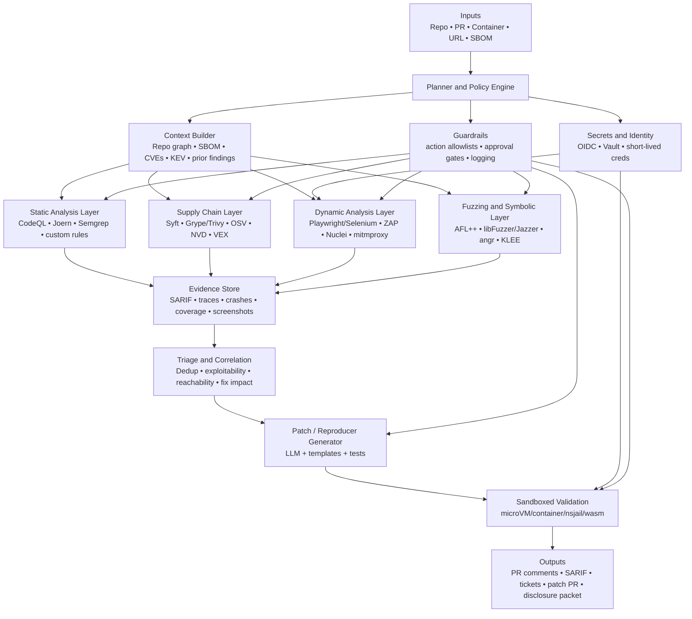

# Agentic Security Analysis Systems

## Executive summary

An effective **agentic security analysis** system in 2026 is not a single “autonomous pentester.” It is a **policy-constrained, tool-using, modular cyber reasoning system** that combines LLM planning with conventional security engines for static analysis, dependency analysis, dynamic testing, symbolic reasoning, fuzzing, and CI/CD-native triage. Recent research consistently shows that pure prompting is not enough: repository-level vulnerability detection benefits from **interprocedural retrieval and thought–action loops**, web vulnerability reproduction still breaks down on **realistic multi-service environments and authentication**, and the strongest autonomous systems in public view are heavily hybridized with **fuzzers, sandboxes, orchestrators, and patch-validation pipelines**. citeturn28view4turn28view2turn33view0turn25view6turn35view0

The most defensible product strategy is therefore **semi-autonomous by default** and **fully autonomous only inside isolated evaluation sandboxes**. The best near-term use cases are: code scanning and taint analysis over repositories; SCA/SBOM-driven dependency reachability and prioritization; web crawling and authenticated regression scanning in pre-production; fuzz-target generation and crash triage; security alert deduplication and risk ranking; and patch suggestion or exploit reproduction **only after explicit authorization and guardrail checks**. This aligns both with tool capabilities in CodeQL, Joern, Semgrep, OWASP ZAP, Nuclei, OSS-Fuzz, and SBOM/vulnerability ecosystems, and with benchmark evidence from PentestGPT, JITVUL, CyberSecEval 2, SecCodePLT, CVE-Bench, and DARPA’s AI Cyber Challenge. citeturn37view0turn37view3turn38search4turn3search2turn15search0turn39search0turn26view1turn28view0turn25view1turn31view1turn32academia19turn35view0

The central design implication is that the system should optimize for **evidence-backed claims**, not just “helpful” model outputs. Findings should be accepted only when backed by code-property-graph evidence, taint traces, differential behavior, crashing inputs, replayable PoCs, or reproducible tests. This matters because recent evaluations show that LLMs and LLM-agents still exhibit substantial weaknesses: they over-analyze benign fixes, miss root causes, remain vulnerable to prompt injection, and often fail to bridge the gap between “running an exploit script” and **actually triggering** a target vulnerability in a realistic environment. citeturn28view2turn28view3turn30view2turn33view0

A practical build plan is to ship in phases. Phase one should deliver deterministic repository scanning, SBOM generation, dependency prioritization, and SARIF-based CI integration. Phase two should add browser automation, authenticated DAST, and sandboxed exploit validation for developer-owned staging environments. Phase three should add fuzzing and constrained patch generation. Phase four should add autonomous campaign orchestration, but only with strong sandboxing, short-lived credentials, provenance on outputs, approval checkpoints, and disclosure workflows. citeturn24search0turn24search10turn8search1turn8search5turn8search18turn8search14turn39search2turn39search15

## Threat models and use cases

The correct threat model for an agentic security analyzer is broader than “find CVEs in code.” The system may inspect **first-party source code**, **third-party dependencies**, **running web applications and APIs**, **build pipelines**, and **deployment artifacts**. That means it must reason about classical software flaws, vulnerable dependencies, insecure configurations, authentication and authorization weaknesses, deserialization and injection issues, patch regressions, and adversarial interactions against the agent itself, including prompt injection, insecure tool invocation, code-interpreter abuse, and excessive agency. CyberSecEval 2, the NIST Generative AI Profile, and the OWASP LLM risk guidance all point to this expanded attack surface. citeturn30view2turn30view3turn9search2turn9search3turn9search8

For **static analysis**, the agent should function as a coordinator over parsers and analyzers rather than as a parser itself. CodeQL represents code as databases queried to find vulnerabilities, while Joern constructs cross-language code property graphs and supports taint analysis and graph queries for vulnerability discovery. These are strong substrates for agentic workflows because they produce structured evidence that an LLM can explain, prioritize, and map to remediation. citeturn37view0turn37view2turn37view3turn37view4

For **dynamic analysis and web application testing**, the user-visible value is not “agent talks like a pentester”; it is **repeatable environment interaction**. OWASP ZAP provides a widely used DAST platform for finding vulnerabilities in running web apps, GitLab’s DAST explicitly targets automated testing of live web applications and APIs, and Playwright/Selenium provide the browser automation needed for JavaScript-heavy applications and authenticated user flows. ProjectDiscovery’s Katana and Nuclei are particularly useful in agentic pipelines because they expose crawling and template-based detection as composable, scriptable stages. citeturn3search2turn6search6turn16search0turn16search13turn14search0turn15search0turn15search9

For **software composition analysis and dependency scanning**, the agent should normalize around SBOMs and public vulnerability sources rather than vendor-specific metadata. Syft generates SBOMs, Grype can scan images, directories, and SBOMs while incorporating EPSS/KEV/OpenVEX signals, Trivy spans vulnerabilities and SBOM use cases, SPDX and CycloneDX define interchange formats, and OSV provides an open vulnerability database and scanner ecosystem. CISA’s Known Exploited Vulnerabilities catalog and NVD are essential enrichment sources for prioritization. citeturn3search4turn23search16turn8search13turn3search0turn4search1turn4search5turn4search8turn4search6turn4search9

For **fuzzing**, the main near-term role of the agent is not to replace coverage-guided engines, but to improve target selection, harness creation, input-model generation, corpus shaping, and crash triage. AFL++, libFuzzer, Jazzer, boofuzz, OSS-Fuzz, and FuzzBench already provide the execution substrate and benchmarking discipline; recent work such as FuzzingBrain V2 shows the strongest public results when LLMs are embedded around these engines rather than used in isolation. citeturn7search0turn7search1turn7search2turn7search3turn39search0turn10search16turn25view6

For **triage and exploit generation**, the highest-value defensive uses are usually: validating whether a finding is reachable, producing a minimal reproducer in a sandbox, distinguishing vulnerable from patched variants, estimating exploitability, and generating a patch candidate plus regression tests. The dual-use risk is real. Public research has already shown high success on one-day exploit generation when CVE descriptions are supplied, nontrivial success on zero-day exploitation with multi-agent systems, and still-low performance on realistic web-vulnerability reproduction benchmarks. That combination argues for strict scoping: exploit workflows should target **owned environments**, require **explicit authorization**, and be separately gated from normal developer scans. citeturn32search0turn25view5turn33view0turn32academia19

### Selected recent papers and benchmarks

| Paper or benchmark | Year | Approach | Main capabilities | Data or environment | Main limitation | Primary source |
|---|---:|---|---|---|---|---|
| PentestGPT | 2024 | Three-module LLM framework with reasoning, generation, and parsing | Automated penetration-testing task decomposition and tool guidance | Real-world pentest targets on local private network | Handles easy/medium targets better than naive GPT-4, but struggles on hard targets and multimodal/social engineering cases | citeturn26view0turn26view1turn26view2turn27view2 |
| CyberSecEval 2 | 2024 | Security benchmark suite for LLMs | Prompt injection, interpreter abuse, exploit helpfulness, safety–utility tradeoff | Open benchmark with prompt-injection and interpreter-abuse suites | Shows strong residual model vulnerability; benchmark is not a full secured system design | citeturn25view1turn30view0turn30view2turn30view3 |
| JITVUL | 2025 | Repository-level benchmark for LLMs and ReAct agents | JIT vulnerability detection with interprocedural context and pairwise vuln/fix comparison | 879 CVEs, 1,758 pairwise commits, 91 vulnerability types | ReAct helps, but agents still misread root causes and over-analyze benign patches | citeturn28view0turn28view2turn28view3turn28view4 |
| From Large to Mammoth | 2025 | Comparative evaluation of many LLMs for file-level detection | Zero-/few-shot vulnerability detection; context-window and quantization analysis | Java and C/C++ datasets including Vul4J-derived corpus | Larger or code-specialized models do not reliably dominate; prompting gains are unstable | citeturn29view0turn29view1turn29view2turn29view3turn29view4 |
| SecCodePLT | 2024 | Unified evaluation platform | Insecure coding and end-to-end cyberattack helpfulness with dynamic metrics | Real execution environments; CWE-based synthesis and validation | Focuses on evaluating model risk more than operating a production defense pipeline | citeturn31view0turn31view1turn31view2turn31view4 |
| CVE-Bench | 2025 | Web-app exploit benchmark for AI agents | Real-world web vulnerability exploitation | Real-world CVEs in sandbox framework | Best state-of-the-art agent resolved only up to 13% of vulnerabilities | citeturn32academia19 |
| LLM Agents for Automated Web Vulnerability Reproduction | 2025 | Benchmarking 20 agents, then 3 top agents | Web vulnerability reproduction across real CVEs | 80 real-world CVEs, 7 vulnerability types, 6 web technologies | End-to-end success below 25%; environment setup and auth are major bottlenecks | citeturn33view0 |
| Teams of LLM Agents can Exploit Zero-Day Vulnerabilities | 2026 | Multi-agent planning with subagents | Zero-day exploitation | Real-world zero-day setting | Demonstrates feasibility, increasing dual-use risk and need for gating | citeturn25view5turn32search4 |
| FuzzingBrain V2 | 2026 | Multi-agent system built around OSS-Fuzz-style reproducibility | Automated vulnerability discovery, localization, and reproduction | AIxCC C/C++ dataset plus real OSS projects | Early-stage research, but strongest public hybrid signal for bug-finding pipelines | citeturn25view6 |

## Required capabilities and reference architecture

The agent needs six capability layers.

**Code understanding** should be grounded in structured program representations, not only raw files. Tree-sitter provides fast incremental parsing and query support, CodeQL builds language-specific databases for query-based analysis, and Joern’s code property graphs unify syntax, control flow, and data-flow style reasoning across languages. These representations are what let an agent move from “this looks suspicious” to “here is the path, sink, caller/callee context, and exact file/line evidence.” citeturn36search0turn36search12turn37view0turn37view2turn37view3turn37view4

**Vulnerability detection** should combine deterministic and probabilistic signals. Deterministic signals come from SAST/taint scans, SCA reachability, known-bad templates, runtime crashes, and symbolic constraints. Probabilistic signals come from LLM reasoning, learned priors over insecure idioms, and ranking models for triage. Research from JITVUL and NDSS 2025 strongly suggests that repository-level context is mandatory for many real vulnerabilities, and that LLM outputs alone remain brittle. citeturn28view4turn28view2turn29view0turn10search1

**Exploit synthesis and validation** should be a separate, high-risk subsystem. It should consume candidate findings plus environment manifests, then attempt bounded validation through sandboxed replay, browser flows, or fuzz-generated triggers. The system should distinguish clearly between: generating a theoretical exploit sketch, proving a vulnerability in a staging sandbox, and generating a portable offensive artifact. Recent work shows that even strong agents frequently fail in realistic environments, so exploit validation should be treated as a constrained evidence step rather than a default feature. citeturn33view0turn32academia19turn25view4

**Environment orchestration** is a first-class requirement. Modern evaluations fail not because models cannot write code, but because they cannot reliably install dependencies, authenticate, coordinate services, or persist state across long investigations. Kubernetes/Tekton or GitHub Actions/GitLab CI can run multi-stage scans; Playwright and Selenium handle browser sessions; mitmproxy and TShark provide traffic inspection; and container- or microVM-based sandboxes provide isolation for untrusted code and exploit replay. citeturn6search14turn6search0turn6search1turn16search0turn16search13turn16search18turn16search3turn17search0turn17search3

**Credential handling** must be minimized. GitHub Actions OIDC can replace long-lived cloud secrets; Vault can issue dynamic credentials; Kubernetes Secrets should only hold the minimum necessary runtime data; and authenticated DAST should use narrowly scoped session material and secret files, not operator credentials pasted into prompts. This is one of the sharpest practical differences between a demo agent and a deployable one. citeturn8search1turn8search6turn8search5turn8search15turn8search2turn8search17turn15search9

**Safe alignment and policy enforcement** cannot rely on model refusal alone. CyberSecEval 2 found material prompt-injection susceptibility and introduced false-refusal tradeoffs; OWASP’s GenAI guidance highlights prompt injection, insecure output handling, supply-chain risk, and excessive agency; and the NIST Generative AI Profile emphasizes systematic risk management rather than purely prompt-level defenses. In practice, that means the system needs an allowlisted tool router, policy checks on every action, separate execution trust domains, immutable audit logs, and approval gates for high-risk transitions. citeturn30view0turn30view2turn9search3turn9search8turn9search2

### Proposed modular architecture

This architecture reflects the strongest public designs. PentestGPT separated reasoning, command generation, and parsing to avoid context collapse; Buttercup’s public AIxCC release exposes distinct orchestrator, fuzzer, patcher, and program-model components deployed with Kubernetes-oriented dependencies; and AIxCC as a whole validated the importance of full-stack cyber reasoning systems rather than standalone models. citeturn26view1turn26view5turn34view0turn34view1turn35view0turn19view0

## Toolchain and integrations

A production system should standardize around **interchange formats and composable runners**. SARIF is the most important result format for code scanning interoperability; GitHub code scanning and third-party tool uploads both center on SARIF 2.1.0. That lets a mixed stack surface alerts in one place even when findings originate from different engines. citeturn24search10turn24search16turn37view1turn24search0turn24search2

For **SAST**, the best open/default substrates are CodeQL, Semgrep Community Edition, and Joern. CodeQL offers mature multi-language analysis and custom query packs; Semgrep CE is lightweight and CI-friendly, with taint-mode support in the open engine; and Joern adds graph-native vulnerability research workflows, including code, bytecode, and binary analysis. A strong design uses at least two complementary static engines, then lets the agent explain disagreements instead of replacing them. citeturn37view0turn37view2turn38search4turn38search1turn38search14turn37view3

For **DAST and web pentesting**, the system should combine broad crawling, targeted detection, and authenticated replay. Katana is effective for endpoint discovery, Nuclei is strong for template-based probes with CI support and authenticated scans, ZAP covers classical DAST use, and Playwright gives robust browser automation for SPAs and authenticated flows. sqlmap should be treated as a specialized validator, not a default always-on component. citeturn14search0turn15search0turn15search7turn15search9turn3search2turn16search0turn14search2

For **fuzzing and runtime exploration**, AFL++, libFuzzer, Jazzer, and boofuzz cover major execution models: native in-process coverage guidance, JVM fuzzing, and protocol fuzzing. OSS-Fuzz and FuzzBench matter because they provide operational maturity and benchmarking methodology, not just engines. If the agent proposes a fuzz harness, the surrounding infrastructure should still be conventional and reproducible. citeturn7search0turn7search1turn7search2turn7search3turn39search0turn10search16

For **orchestration**, GitHub Actions, GitLab security scanning, Tekton, and Kubernetes are the practical baseline. GitHub and GitLab both support security scanning directly in CI/CD, while Tekton gives cloud-native task composition on Kubernetes. Agentic systems should treat each scan family as an idempotent task that can be retried, rate-limited, and policy-checked independently. citeturn6search0turn6search6turn6search1turn6search11turn6search14turn6search9

For **supply-chain and artifact integrity**, the strongest open stack is Syft or CycloneDX/SPDX generation, Grype or Trivy scanning, OSV/NVD/KEV enrichment, OpenVEX filtering, and Sigstore/Cosign plus SLSA attestations for outputs. That lets an agent tell the difference between “package is vulnerable,” “package is present,” “package is reachable,” and “vulnerability is not applicable to this product.” citeturn3search4turn4search1turn4search8turn4search6turn4search9turn23search0turn23search16turn8search3turn8search14turn8search19

### Recommended open-source stack by function

| Function | Recommended core components | Why they fit an agentic system | Primary source |
|---|---|---|---|
| Parsing and code IR | Tree-sitter, CodeQL, Joern | Fast ASTs plus queryable code databases and code property graphs | citeturn36search0turn37view0turn37view3 |
| Static vulnerability analysis | CodeQL, Semgrep CE, Joern taint | Complementary rule/query/graph strengths, CI-ready results | citeturn37view0turn38search4turn37view3 |
| Dynamic web testing | ZAP, Playwright, Katana, Nuclei, sqlmap | Browser + crawler + template + specialized probe coverage | citeturn3search2turn16search0turn14search0turn15search0turn14search2 |
| Fuzzing | AFL++, libFuzzer, Jazzer, boofuzz, OSS-Fuzz | Coverage-guided and protocol fuzzing with operational ecosystem | citeturn7search0turn7search1turn7search2turn7search3turn39search0 |
| Symbolic / concolic | angr, KLEE | Constraint solving and path reasoning for hard-to-reach states | citeturn4search0turn4search1 |
| SCA and SBOM | Syft, Grype, Trivy, OSV Scanner, SPDX, CycloneDX, OpenVEX | Artifact-first dependency analysis and vulnerability applicability | citeturn3search4turn23search16turn4search1turn4search8turn4search5turn23search0 |
| CI/CD and orchestration | GitHub Actions, GitLab CI Security, Tekton/Kubernetes | Native scheduling, isolation, and reporting | citeturn6search0turn6search1turn6search14 |
| Isolation and execution control | nsjail, gVisor, Firecracker, Wasmtime, seccomp | Multiple trust boundaries for untrusted code and exploits | citeturn17search0turn4search3turn4search4turn17search3turn17search1 |
| Identity, secrets, provenance | Vault, GitHub OIDC, Kubernetes Secrets, Cosign, SLSA | Short-lived creds and verifiable artifacts | citeturn8search5turn8search1turn8search2turn8search3turn8search14 |

## Datasets, benchmarks, and evaluation methodology

Benchmark choice strongly shapes apparent capability. Older synthetic datasets such as **Juliet/SARD** and **Securibench Micro** remain useful for regression and unit-style testing, and the **OWASP Benchmark** is still valuable because it is runnable and can be used against SAST, DAST, and IAST tools. But recent work has shown that many widely used vulnerability datasets overestimate real-world performance because of label issues, duplication, or unrealistic splits. citeturn10search3turn10search19turn10search10turn22search6turn22search2turn10search1

For repository and code-model evaluation, the current higher-value corpora are **DiverseVul**, **PrimeVul**, and **JITVUL**. DiverseVul expanded project diversity and CWE breadth; PrimeVul was designed to reduce leakage and improve label fidelity for realistic evaluation; and JITVUL adds pairwise vulnerable/fixed comparisons plus repository context. If the system claims repository-scale reasoning, it should not be evaluated only on isolated function classification. citeturn10search0turn10search1turn28view0

For agentic cybersecurity evaluation specifically, **CyberSecEval 2**, **SecCodePLT**, **CVE-Bench**, and the 2025 AIxCC corpus are more informative than generic code-generation leaderboards. CyberSecEval 2 is valuable for agent-side failure modes such as prompt injection and code interpreter abuse; SecCodePLT adds dynamic evaluation for insecure coding and cyberattack helpfulness; CVE-Bench targets real-world web vulnerability exploitation; and AIxCC is the strongest public demonstration that full cyber reasoning systems can find and patch nontrivial vulnerabilities at scale under competition conditions. citeturn25view1turn31view1turn32academia19turn35view0turn19view0

A rigorous evaluation program should use **multiple metric families**. For detection: precision, recall, F1, CWE-stratified performance, false positive rate, and pairwise vulnerable-versus-patched accuracy. For dynamic validation: exploit success rate, environment setup success, authenticated-flow success, crash uniqueness, coverage growth, time-to-first-finding, and reproducibility rate. For remediation: patch-compiles, test-pass rate, security regression pass rate, and manual acceptability. For operational deployment: scan latency, token/compute cost, queue throughput, SARIF quality, and analyst-hours saved. CyberSecEval 2’s False Refusal Rate is also useful for measuring harmful over-blocking in analyst-assist modes. citeturn28view3turn31view2turn10search16turn24search2turn30view0

The key methodological rule is to separate **capability** from **workflow reality**. A model that can identify a vulnerable code pattern is not necessarily a useful agent in a repository; an agent that writes a PoC is not necessarily able to stand up the target stack; and a patch that makes tests pass is not necessarily secure. The web-reproduction and AIxCC results both underline that end-to-end realism changes the ranking of systems. citeturn33view0turn35view0

## Safety, ethics, and legal constraints

This category is not ancillary; it is part of the core architecture. The system itself has a large attack surface: prompt injection, hostile repositories, malicious build scripts, poisoned tool output, dependency confusion, secrets exfiltration, and dual-use misuse by insiders or external users. OWASP’s LLM guidance and NIST’s Generative AI Profile both argue for defense in depth: scoped permissions, trust boundaries, monitoring, provenance, and risk-specific controls rather than “alignment” alone. citeturn9search3turn9search8turn9search2

**Sandboxing** should assume compromise. Untrusted repos, PoCs, harnesses, package installs, and generated patches should run in isolated containers, jails, microVMs, or WebAssembly runtimes with syscall and network restrictions. nsjail uses namespaces, cgroups, rlimits, and seccomp-bpf; seccomp narrows syscall surface; Wasmtime is explicitly designed for safe untrusted-code execution; and gVisor or Firecracker add stronger runtime isolation for Linux workloads. citeturn17search0turn17search1turn17search3turn4search3turn4search4

**Data privacy and secret safety** require that the model sees as little sensitive context as possible. Prefer repository-local scans, retrieval of only the minimal code slices needed for reasoning, OIDC federation over long-lived cloud keys, Vault-generated short-lived credentials, and narrow-scoped Kubernetes secrets. Authenticated DAST should bind secrets to one ephemeral target environment and erase them after the run. citeturn8search1turn8search5turn8search15turn8search2turn15search9

**Dual-use risk** is not hypothetical. Public papers already demonstrate high performance on one-day exploitation and nontrivial zero-day exploitation. The right product response is not to ban all exploit reasoning, because defenders need reproductions and prioritization, but to impose strict authorization, isolated testing environments, auditable action logs, rate-limited tooling, and explicit user intent separation between “defensive validation” and “offensive autonomy.” citeturn32search0turn25view5turn33view0

**Responsible disclosure** should be designed into the pipeline. CISA’s coordinated vulnerability disclosure guidance and the CERT CVD guide both emphasize structured reporting and reduced societal harm. Google’s disclosure policy illustrates a concrete timeline-based model. For an agentic system, that means a “disclosure packet” generator should be a standard output: minimal reproducer, affected versions, patch or mitigation, confidence level, and evidence bundle, with automatic suppression of public artifact release until approval. citeturn39search2turn39search15turn39search19

**Supply-chain trust** matters for the agent’s own outputs. Sign artifacts with Sigstore/Cosign, emit SLSA-compatible attestations, and attach VEX/OpenVEX statements when the system determines that a dependency finding is not applicable. Otherwise the agent becomes a new source of unauditable security noise. citeturn8search3turn8search14turn23search0turn23search16

## Implementation roadmap and open research questions

A sensible implementation roadmap is to build **capability in concentric risk rings**.

**Milestone one** should produce a repository-centric assistant that ingests code, builds IRs, runs CodeQL/Semgrep/Joern, generates SBOMs with Syft, scans dependencies with Grype or Trivy, enriches with OSV/NVD/KEV, and emits SARIF back into GitHub or GitLab. No exploit generation, no runtime interaction, and only read-only credentials. Success criteria are stable CI integration, low operational false positives, and analyst acceptance of triage explanations. citeturn37view0turn38search4turn37view3turn3search4turn23search16turn4search8turn4search6turn4search9turn24search0

**Milestone two** should add dynamic environment analysis for developer-owned staging systems: Playwright/Selenium for login flows, Katana plus Nuclei for discovery and regression checks, optional ZAP for broader DAST, and isolated network telemetry through mitmproxy or TShark. This milestone is where the system starts to produce evidence beyond static predictions. Success criteria are authenticated scan reliability, environment reproducibility, and replayable evidence artifacts. citeturn16search0turn16search13turn14search0turn15search0turn3search2turn16search18turn16search3

**Milestone three** should add fuzzing and constrained validation. The agent proposes or repairs fuzz harnesses, seeds corpora, launches AFL++/libFuzzer/Jazzer campaigns, clusters crashes, and correlates them with static findings. This phase should also add symbolic assistance through angr or KLEE for hard reachability questions. Success criteria are improved coverage, unique crash yield, and a measurable reduction in manual triage effort. citeturn7search0turn7search1turn7search2turn39search0turn10search16turn4search0turn4search1

**Milestone four** should add patch suggestion and limited exploit reproduction under explicit authorization. Here the system proposes patches, validates them in sandboxes, signs artifacts, and assembles disclosure packets. This is also the point to study open AIxCC CRSs such as Atlantis, Buttercup, Fuzzing Brain, and the broader archive, because they expose concrete orchestration patterns that the literature alone often abstracts away. Success criteria are patch validity, regression resistance, and trustworthy governance around high-risk actions. citeturn19view0turn20view0turn21view3turn21view0turn35view0

The biggest open research gaps are clear.

First, **repository-scale reasoning remains weak**. Recent work shows that interprocedural retrieval helps, but agents still miss causal chains and struggle to compare vulnerable and patched variants robustly. Better integration of static analysis, constraint solving, and retrieval appears more promising than simply increasing model size. citeturn28view4turn28view2turn29view2

Second, **environment adaptation is the bottleneck for web and service-based security tasks**. Current agents can often write code or run a PoC, but they fail on service composition, dependency drift, auth, and state management. This suggests that future progress may depend as much on orchestration research and environment representations as on model capability. citeturn33view0turn32academia19

Third, **falsifiability and evidence quality** are underdeveloped. Benchmarks increasingly show that dynamic validation beats rule-only or LLM-judge-only scoring, yet much of the ecosystem still reports headline success without robust replayability or artifact provenance. Systems that cannot emit reproducible evidence will have lower operational trust than their benchmark numbers suggest. citeturn31view2turn24search10turn8search14

Fourth, **agent safety remains unsolved**. Prompt injection resistance, safe tool routing, interpreter containment, and secure secret handling are still system problems, not only model problems. The architecture should therefore assume that the model is sometimes wrong, sometimes manipulated, and sometimes overconfident. citeturn30view2turn30view3turn9search2turn9search8

The design recommendation that follows from all of this is straightforward: build the system as a **deterministic security platform with an agentic orchestrator**, not as an LLM product with some security tools attached. The highest-confidence path is hybrid, evidence-first, CI-native, safely sandboxed, and auditable end to end. citeturn35view0turn25view6turn37view0turn39search15